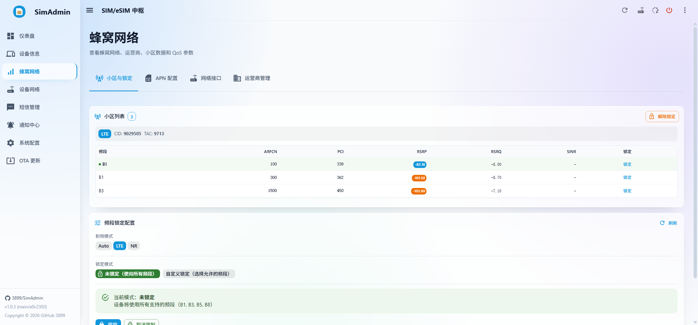
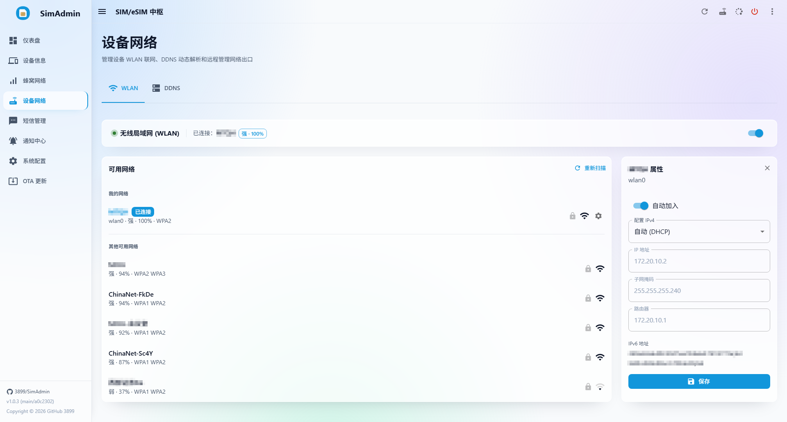
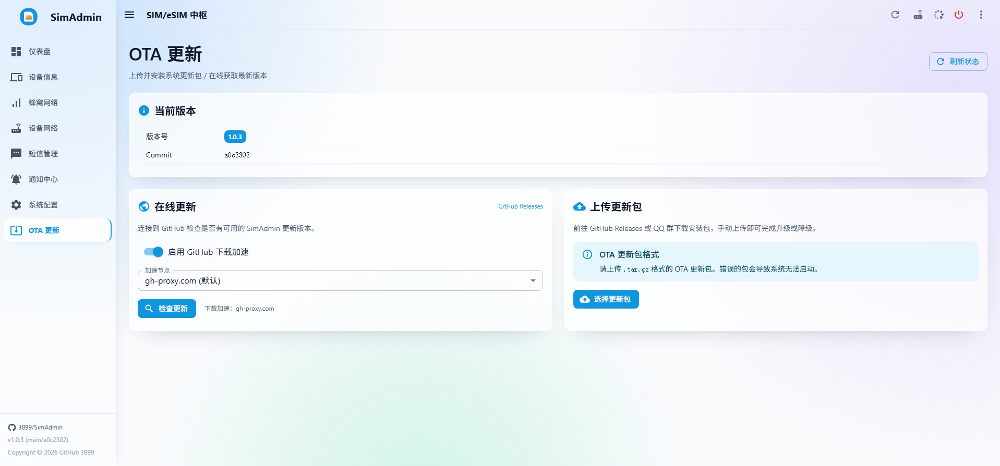
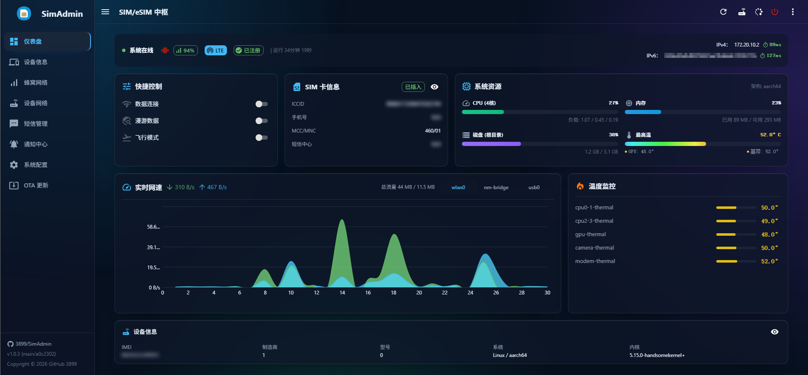
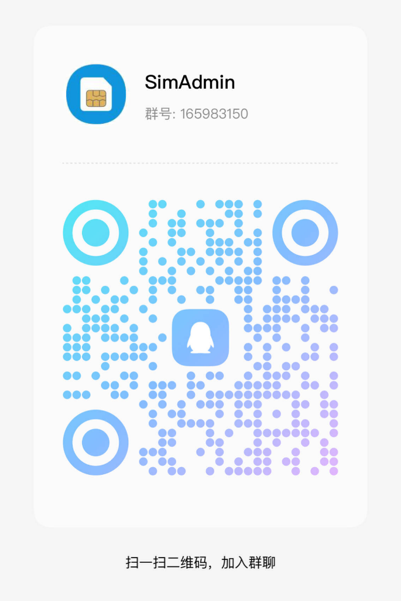

   

  

    <a href="https://github.com/3899/SimAdmin/releases">
      
    </a >
    <a href="./LICENSE">
      
    </a >
    <a href="https://github.com/3899/SimAdmin/releases">
      
    </a >
    <a href="https://github.com/3899/SimAdmin/releases">
        
    </a >
  

   

  <picture>
    
	  
	
	  
	
	  
	
	  
	
	  
	
	  
	
	  
	
	  
	
	  
	
	  
	
	  
	
	  
	
	  
	
	  
	
	  
	
	  
  </picture>
  

# SimAdmin - SIM/eSIM 中枢

SimAdmin 是一套面向 Debian 蜂窝 CPE、随身 WiFi、软路由类设备的 SIM/eSIM、蜂窝网络、短信、系统状态与 WiFi Calling 管理系统。

**💡 核心亮点 —— 支持 WiFi Calling (VoWiFi)**：原生实现 IKEv2/IPsec 全链路能力，无第三方程序依赖；依托 SIM 硬件鉴权搭建加密隧道，无蜂窝信号、飞行模式下仍可通过无线网络完成 IMS 注册与加密短信收发。

当前项目由 Rust 后端和 React 前端组成：

- 后端：Rust + Axum + zbus，主要通过 ModemManager D-Bus 接口管理 modem，并在部分场景使用 `mmcli`、`qmicli` 或 AT 直连兜底。
- 前端：React + Vite + Material UI，提供仪表盘、SIM 卡管理、蜂窝网络、设备网络、短信管理、通知中心、自动化中心和 OTA 更新页面。
- 部署形态：后端二进制同进程托管前端 SPA，默认安装到 `/opt/simadmin`，通过 systemd 运行。

健康检查整体按支持 ModemManager 的 Linux 蜂窝设备组织，不同 modem 固件、内核、ModemManager 版本暴露的能力不同，具体功能以实际设备为准。

## 📖 文档导航

*   🚀 **[安装与部署指南 (docs/INSTALL.md)](./docs/INSTALL.md)**：设备侧一键安装、升级、卸载以及首次管理员密码设置。
*   📜 **[版本更新记录 (docs/CHANGELOG.md)](./docs/CHANGELOG.md)**：历史版本（从 v1.0.1 至最新的 v1.1.3）详细的更新说明日志。
*   ⚙️ **[运行环境与系统管理 (docs/ENVIRONMENT.md)](./docs/ENVIRONMENT.md)**：目标设备硬件与依赖指令要求、默认安装路径、eSIM/VoWiFi 管理机制、systemd 服务维护及数据持久化。
*   🛠️ **[开发者指南 (docs/DEVELOPER.md)](./docs/DEVELOPER.md)**：项目工程结构、前端与后端开发编译、OTA 构建、ADB 部署调试及 D-Bus 接口说明。
*   🔌 **[REST API 接口文档 (bruno-api/README.md)](./bruno-api/README.md)**：详细的 REST API 路由映射表、请求/响应报文规约与 Bruno API 调试集合。

---

## 免责声明

本项目会直接操作蜂窝 modem、SIM 注册、数据拨号、APN、频段、飞行模式、NetworkManager、systemd 服务、系统重启和 OTA 文件替换；iptables/ip6tables 仅用于只读网络诊断，不会自动清空宿主机防火墙规则。

请仅在你拥有控制权的设备上使用。错误配置可能导致断网、无法注册网络、SIM 漫游计费、设备需要手动恢复，甚至 OTA 后服务无法启动。任何使用本项目造成的后果由使用者自行承担。

部分接口受硬件和 ModemManager 能力限制：

- 频段锁定依赖 ModemManager 暴露的 `SupportedBands` / `CurrentBands` / `SetCurrentBands`。
- 小区锁定当前为后端内存态展示，不会下发真实硬件锁小区命令。

## 开源协议声明

本项目采用 GNU General Public License v3.0 (GPLv3) 开源协议。

你可以：

- 自由使用、研究、修改本软件。
- 分发本软件副本。
- 分发修改后的版本。

但你必须：

1. 保留版权声明和许可证声明。
2. 分发本软件或修改版本时，以 GPLv3 协议公开完整源代码。
3. 基于本项目的衍生作品继续使用 GPLv3 协议。
4. 明确标注修改内容和修改日期。
5. 分发时附带完整 GPLv3 许可证文本。

严禁将本项目或其衍生版本闭源后作为专有软件分发。

## 社区交流

⚠️ 温馨提示：群聊仅限日常讨论和经验分享，如需反馈问题或提交新需求。

<table>
  <thead>
    <tr>
      <th width="50%">QQ 群</th>
    </tr>
  </thead>
  <tbody>
    <tr>
      <td>
        <picture>
          <source media="(prefers-color-scheme: dark)" srcset="./static/Community/Community_QQ_Dark.png" />
          <source media="(prefers-color-scheme: light)" srcset="./static/Community/Community_QQ_Light.png" />
          
        </picture>
      </td>
    </tr>
  </tbody>
</table>

---

## 核心功能

### Web 管理页面

| 页面 | 路由 | 说明 |
|------|------|------|
| 登录认证 | `/login` | 首次设置管理员密码、登录后台 |
| 仪表盘 | `/` | 包含在线状态、运营商、信号、网络延迟、数据/漫游/飞行模式快捷开关、系统资源、温度、流量，以及设备信息 |
| SIM 卡管理 | `/sim` | 全面展示卡状态、标识信息、解锁次数及存储路径，支持号码与短信中心行内修改；在 eSIM 模式下集成管理与写卡功能，在开启 WiFi Calling 时提供连接状态与耗时时序图诊断看板 |
| 蜂窝网络 | `/network` | 网络注册、服务小区和邻区、运营商扫描、APN、射频模式、频段锁定、小区锁定状态 |
| 设备网络 | `/device-network` | WLAN 客户端联网、无线网络扫描和连接、DDNS 动态解析配置和同步日志 |
| 短信管理 | `/sms` | 接收短信、发送短信、短信列表、会话、统计、删除对话、删除短信 |
| 通知中心 | `/notifications` | 转发日志、转发规则、转发通道、多通道测试发送 |
| 自动化中心 | `/automation` | 管理自动化任务，以及检索、筛选和清理任务执行日志 |
| 系统配置 | `/config` | 基本系统配置，包含设备运行模式设置、数据连接、漫游、飞行模式等 |
| 安全性设置 | `/config/security` | 管理员密码修改、密码策略、登录保护及会话超时等安全配置 |
| OTA 更新 | `/ota` | 上传 OTA 包、在线获取 Release、验证、应用或取消更新 |

### 后端能力

- 单管理员密码登录，支持首次设置、会话 Cookie、受保护 API 拦截 and SSH 本机恢复。
- 设备信息、SIM 信息、网络注册信息读取。
- 数据连接开关和漫游策略持久化。
- 飞行模式控制。
- 基带重启流程和进度查询。
- 数据连接 watchdog，每 15 秒检查连接状态、iptables 规则数量和 modem 可用性；检测到宿主机防火墙规则时仅记录诊断日志，不自动清空规则。
- ModemManager 丢失时触发 `mmcli --scan-modems`，连续失败后重启 ModemManager。
- NetworkManager `wwan*` unmanaged 配置。
- 设备侧 WLAN 客户端连接管理，通过 NetworkManager/nmcli 扫描和连接无线局域网，WLAN 在线时优先作为设备默认出口。
- 原生 DDNS 同步，支持腾讯云 DNSPod、阿里云 AliDNS 和 Cloudflare，支持 IPv4/IPv6 独立配置、API/网卡取 IP 和变更/失败事件通知；默认通过网卡取 IP，可切换为内置多接口 API fallback。
- 短信发送、接收监听、SQLite 持久化和多渠道通知转发。
- 自动化中心双轨任务调度引擎：支持在后台并行执行自动化任务，提供`定点定时`（周几 + 具体时间，如每周二 03:00）和`间隔周期`（按分钟/小时/天，如每 180 天）调度模式。
- 多种自动化动作支持：支持`重启基带`、`安全重启系统`（支持延时）和`发送短信`（支持随机延迟、自动生成随机字符防止拦截、发送失败自动重试）。
- 自动化事件通知与运行日志管理：任务执行后写入本地 SQLite 日志表（支持关键词检索、日期筛选、手动/自动清理策略），并可将执行结果（成功/失败）作为事件实时推送至通知通道。
- APN 列表读取和 APN 修改。
- 运营商列表、扫描、手动注册、自动注册。
- eSIM 模式下按需调用 `lpac` 管理实体 eUICC SIM 卡 Profiles；普通 SIM 模式下不调用 eSIM 能力。
- 安装脚本按设备架构自动准备私有 `lpac`；OTA 包本身不绑定 `lpac` 架构或版本。
- OTA 上传、在线下载、校验、替换二进制和前端资源。
- 实现用户态 IKEv2 协议协商与 IPsec/ESP 安全报文加解密，提供零外部依赖的 VoWiFi 运行环境。
- 集成 QMI UIM D-Bus 接口直连硬件，利用实体/eSIM卡的物理硬件鉴权能力，支持 3GPP 规范的 EAP-AKA 鉴权。
- 支持 3GPP 动态运营商配置预设生成，自动解析 MCC/MNC 推导 ePDG 网关并原生支持大部分标准网络运营商。
- 落地用户态虚拟 TUN 路由转发与 IMS 注册，集成 SMS over IPsec 安全短信收发机制。
- 细化的 VoWiFi 错误诊断系统与连接状态时序图，支持连接中断后智能退避重试与自动恢复。

---

## 🎖️ 鸣谢

### 👥 贡献者

- [crossgg](https://github.com/crossgg)

### 📦 参考项目

- [project-cpe](https://github.com/1orz/project-cpe)
- [SmsForwarder](https://github.com/pppscn/SmsForwarder)
- [ddns-go](https://github.com/jeessy2/ddns-go)
- [strongSwan](https://github.com/strongswan/strongswan) (VoWiFi / ePDG IPsec 隧道与 IKEv2/EAP-AKA 协议实现)
- [smoltcp](https://github.com/smoltcp-rs/smoltcp) (用户态 TCP/IP 协议栈及虚拟网关路由设计)
- [sip-core](https://github.com/snipsco/sip-core) (IMS SIP 信令解析与注册流处理)
- [Open5GS](https://github.com/open5gs/open5gs) / [free5GC](https://github.com/free5gc/free5gc) (3GPP 标准网元 ePDG/IMS 功能及域名的互操作规范)
- [AOSP CarrierConfig](https://android.googlesource.com/platform/packages/apps/CarrierConfig/) (安卓标准运营商配置与 3GPP 动态降级回退机制设计)
- [mobile-broadband-provider-info](https://gitlab.gnome.org/GNOME/mobile-broadband-provider-info) (移动宽带运营商数据匹配与基准拨号参数设计)
